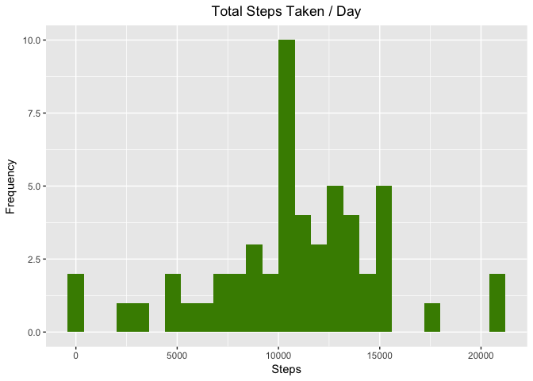
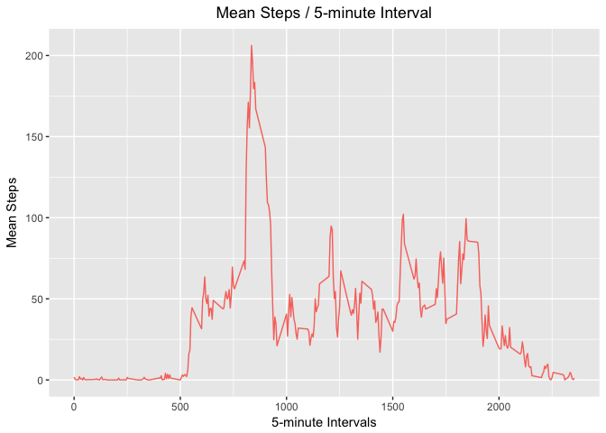
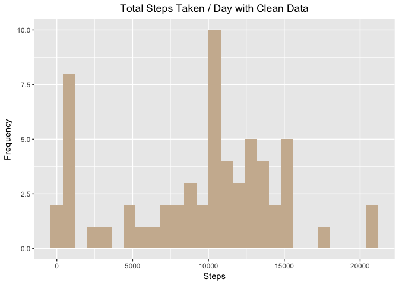
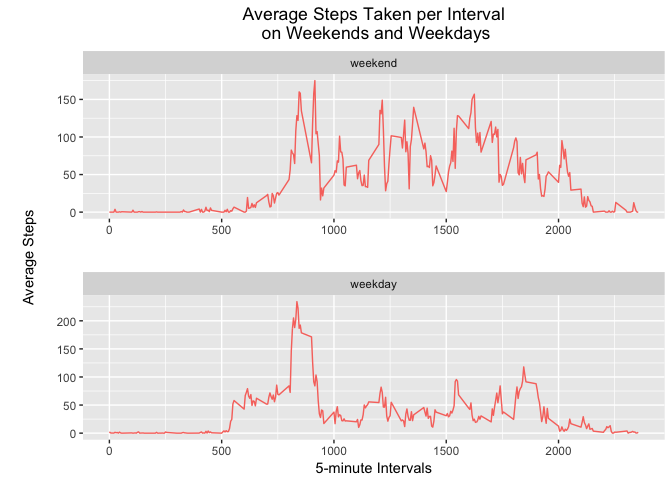

## Loading and preprocessing the data
<br />
Before anything else, let us load the necessary libraries. 


```r
library(ggplot2)
library(plyr)
```
<br />

##### 1. Load the data (i.e. read.csv())
##### 2. Process/transform the data (if necessary) into a format suitable for your analysis

**Answer:** First, we unzip and extract the data. We can assume that the data is included in the directory and will extract from "activity.zip" as per the course instructions. We will extract inside the "data" directory. After reading, we will load the data into a variable. 


```r
unzip("activity.zip", exdir = "data")
aData <- read.csv("data/activity.csv", header = TRUE, sep = ",")

head(aData)
```

```
##   steps       date interval
## 1    NA 2012-10-01        0
## 2    NA 2012-10-01        5
## 3    NA 2012-10-01       10
## 4    NA 2012-10-01       15
## 5    NA 2012-10-01       20
## 6    NA 2012-10-01       25
```
<br />

## What is mean total number of steps taken per day?
<br />

##### 1. Calculate the total number of steps taken per day

**Answer:** Using the *aggregate* function, group by date and apply the *sum* function.


```r
avgDaily <- aggregate(aData$steps, by=list(date=aData$date), sum)

head(avgDaily)
```

```
##         date     x
## 1 2012-10-01    NA
## 2 2012-10-02   126
## 3 2012-10-03 11352
## 4 2012-10-04 12116
## 5 2012-10-05 13294
## 6 2012-10-06 15420
```
<br />

##### 2. If you do not understand the difference between a histogram and a barplot, research the difference between them. Make a histogram of the total number of steps taken each day.

**Answer:** We create a histogram via *ggplot*, using the data prepared earlier.


```r
ggplot(avgDaily, aes(x)) +
  geom_histogram(fill = 'chartreuse4', binwidth = 800) +
  xlab('Steps') +
  ylab('Frequency') +
  ggtitle('Total Steps Taken / Day') +
  theme(plot.title = element_text(hjust = 0.5))
```

```
## Warning: Removed 8 rows containing non-finite values (stat_bin).
```

<!-- -->
<br />

##### 3. Calculate and report the mean and median of the total number of steps taken per day

**Answer:** Use *mean* and *median* on the previous *avgDaily* variable and build a dataframe from it.


```r
stepsMeanAndMedian <- data.frame(MEAN_STEPS=mean(avgDaily$x, na.rm=TRUE), MEDIAN_STEPS=median(avgDaily$x, na.rm=TRUE))
stepsMeanAndMedian
```

```
##   MEAN_STEPS MEDIAN_STEPS
## 1   10766.19        10765
```
<br />

## What is the average daily activity pattern?
<br />

##### 1. Make a time series plot (i.e. type = "l") of the 5-minute interval (x-axis) and the average number of steps taken, averaged across all days (y-axis)

**Answer:** Use the *aggregate* function and retrieve the mean per interval, laying down the interval for the x axis and plot with *ggplot*. We will also omit NAs to properly get the mean.


```r
avgPerInterval <- aggregate(aData$steps, by=list(interval=aData$interval), mean, na.rm=TRUE)
head(avgPerInterval)
```

```
##   interval         x
## 1        0 1.7169811
## 2        5 0.3396226
## 3       10 0.1320755
## 4       15 0.1509434
## 5       20 0.0754717
## 6       25 2.0943396
```


```r
ggplot(avgPerInterval, aes(avgPerInterval$interval, x, color='coral3')) +
  geom_line() +
  xlab('5-minute Intervals') +
  ylab('Mean Steps') +
  ggtitle('Mean Steps / 5-minute Interval') +
  theme(legend.position="none", plot.title = element_text(hjust = 0.5))
```

<!-- -->
<br />

##### 2. Which 5-minute interval, on average across all the days in the dataset, contains the maximum number of steps?

**Answer:**  Use *max* on the *avgPerInterval* variable and build a dataframe from it.


```r
maxMean <- subset(avgPerInterval, x == max(avgPerInterval$x))
maxMean
```

```
##     interval        x
## 104      835 206.1698
```
<br />

## Imputing missing values
<br />

##### 1. Calculate and report the total number of missing values in the dataset (i.e. the total number of rows with NAs)

**Answer:** Use *sum* to quickly compute using conditional indexing.


```r
sum(is.na(aData$steps))
```

```
## [1] 2304
```
<br />

##### 2. Devise a strategy for filling in all of the missing values in the dataset. The strategy does not need to be sophisticated. For example, you could use the mean/median for that day, or the mean for that 5-minute interval, etc.

**Answer:** Use the mean value of the steps in a day to replace NA rows by imputing and using *ddply*.


```r
rpNAsteps <- aData
imputeMean <- function(x) replace(x, is.na(x), median(x, na.rm = TRUE))
rpNAsteps <- ddply(rpNAsteps, ~interval, transform, steps = imputeMean(steps))
head(rpNAsteps)
```

```
##   steps       date interval
## 1     0 2012-10-01        0
## 2     0 2012-10-02        0
## 3     0 2012-10-03        0
## 4    47 2012-10-04        0
## 5     0 2012-10-05        0
## 6     0 2012-10-06        0
```
<br />

##### 3. Create a new dataset that is equal to the original dataset but with the missing data filled in.

**Answer:** Not quite sure what the instructor meant by creating a new dataset, but I suppose that this means to print the data to a file.


```r
write.csv(rpNAsteps,'data/noNA_Activity.csv', row.names=FALSE)
```
<br />

##### 4.1 Make a histogram of the total number of steps taken each day.

**Answer:** Use the *aggregate* function and retrieve the mean per interval, similar to the solution earlier.


```r
noNAavgDaily <- aggregate(rpNAsteps$steps, by=list(date=rpNAsteps$date), sum)
ggplot(noNAavgDaily, aes(x)) +
  geom_histogram(fill = 'bisque3', binwidth = 800) +
  xlab('Steps') +
  ylab('Frequency') +
  ggtitle('Total Steps Taken / Day with Clean Data') +
  theme(plot.title = element_text(hjust = 0.5))
```

<!-- -->
<br />

##### 4.2 Calculate and report the mean and median total number of steps taken per day. 

 **Answer:** As with the solution before, use *mean* and *median* to build a new dataframe on the clean data.


```r
cleanStepsMnM <- data.frame(MEAN_STEPS=mean(noNAavgDaily$x, na.rm=TRUE), MEDIAN_STEPS=median(noNAavgDaily$x, na.rm=TRUE))
cleanStepsMnM
```

```
##   MEAN_STEPS MEDIAN_STEPS
## 1   9503.869        10395
```
<br />

##### 4.3 Do these values differ from the estimates from the first part of the assignment?

**Answer:** Yes.
<br /><br />

##### 4.4 What is the impact of imputing missing data on the estimates of the total daily number of steps?

**Answer:** Both values have changed, reflecting the additional values for rows that were omitted before. 
<br />

## Are there differences in activity patterns between weekdays and weekends?
<br />

##### 1. Create a new factor variable in the dataset with two levels – “weekday” and “weekend” indicating whether a given date is a weekday or weekend day.

**Answer:** First, we ensure that the *date* column in our data set is formatted as a date. Then, we create a vector containing the valid weekdays in a week. We then label the rows using the additional column with *factor*.


```r
tmpdf <- aData
tmpdf$date <- as.Date(tmpdf$date)
cWeekdays <- c('Monday', 'Tuesday', 'Wednesday', 'Thursday', 'Friday')
tmpdf$weekend_factor <- factor((weekdays(tmpdf$date) %in% cWeekdays),
                            levels=c(FALSE, TRUE), labels=c('weekend', 'weekday'))
head(tmpdf)
```

```
##   steps       date interval weekend_factor
## 1    NA 2012-10-01        0        weekday
## 2    NA 2012-10-01        5        weekday
## 3    NA 2012-10-01       10        weekday
## 4    NA 2012-10-01       15        weekday
## 5    NA 2012-10-01       20        weekday
## 6    NA 2012-10-01       25        weekday
```
<br />

##### 2. Make a panel plot containing a time series plot (i.e. type = "l") of the 5-minute interval (x-axis) and the average number of steps taken, averaged across all weekday days or weekend days (y-axis). See the README file in the GitHub repository to see an example of what this plot should look like using simulated data.

**Answer:** Using *ggplot* we create a panel plot that illustrates the steps average in different plots for weekdays and weekends.


```r
avgwf <- aggregate(steps~interval+weekend_factor, tmpdf, mean, na.rm=TRUE)
np <- ggplot(avgwf, aes(avgwf$interval, steps, color='darkgoldenrod2')) +
  geom_line() +
  labs(y="\nAverage Steps\n", x="5-minute Intervals") +
  ggtitle("Average Steps Taken per Interval\n on Weekends and Weekdays") +
  theme(plot.title = element_text(hjust = 0.5)) +
  theme(legend.position="none") +
  facet_wrap(~weekend_factor, ncol=1,  scales = "free") +
  theme(panel.spacing = unit(2, "lines"))
print(np)
```

<!-- -->
